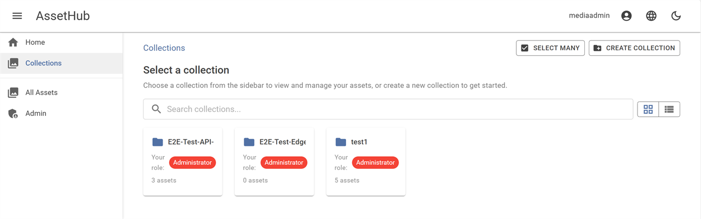

<div align="center">

# AssetHub

**Self-hosted digital asset management for teams who want enterprise features without vendor lock-in.**

Organise images, videos, and documents into collections. Control access with per-collection roles. Share via password-protected links. Get automatic thumbnails and previews — all on your own infrastructure.

[](#tech-stack)
[](LICENSE)
[](#quick-start)
[](#modular-components)


</div>

---

## Table of Contents

- [Quick Start](#quick-start)
- [Features](#features)
- [Screenshots](#screenshots)
- [Architecture](#architecture)
- [Modular Components](#modular-components)
- [Security](#security)
- [Deployment](#deployment)
- [Testing](#testing)
- [Documentation](#documentation)
- [Contributing](#contributing)
- [License](#license)

---

## Quick Start

**Prerequisites:** [Docker](https://docs.docker.com/get-docker/) and [Docker Compose](https://docs.docker.com/compose/install/)

**1. Clone and start**

```bash
git clone <repository-url>
cd AssetHub
docker compose up --build
```

**2. Add hostnames** (required for OIDC)

Add this line to your hosts file (`C:\Windows\System32\drivers\etc\hosts` on Windows, `/etc/hosts` on Linux/Mac):

```
127.0.0.1 assethub.local keycloak.assethub.local
```

**3. Open and log in**

Navigate to **https://assethub.local:7252** and sign in:

| User | Password | Role |
|------|----------|------|
| `mediaadmin` | `mediaadmin123` | Admin |
| `testuser` | `testuser123` | Viewer |

> All default passwords and connection strings are in [CREDENTIALS.md](CREDENTIALS.md).

---

## Features

**Asset Management**
- Drag-and-drop upload with multi-collection organisation
- Faceted search — Postgres `tsvector` full-text over title, description, tags, and searchable metadata values with live facet counts (asset type, collection, tags, status) and saved searches per user
- Custom metadata schemas and taxonomies — admin-defined structured fields (text, numeric, date, select, taxonomy) scoped globally, per asset type, or per collection, with required-field and pattern validation
- Canvas-based image editor (Fabric.js) — crop, rotate, flip, resize, draw, text overlays, and multi-layer composition with save-as-copy or replace-original
- Export presets — admin-defined output formats, dimensions, quality, and fit modes applied automatically on save
- Asset lineage tracking — derivatives link back to their parent/original asset
- Bulk migration toolkit — import thousands of assets from external sources with progress tracking and resumability
- Video poster extraction via ffmpeg with inline playback
- Download collections or shared content as zip archives
- Auto-generated thumbnails, previews, and video posters
- On-the-fly image renditions — `GET /api/v1/assets/{id}/render?w=400&h=200&fit=cover&fmt=webp` returns a redirect to a cached MinIO rendition; first hit generates synchronously, subsequent hits serve from MinIO. Strict allowlist on dimensions / formats / fit modes prevents resize-DoS

**Access Control & Sharing**
- Per-collection RBAC — Viewer, Contributor, Manager, Admin (system admins bypass all ACLs)
- Password-protected, time-limited share links
- Admin dashboard with user management, share admin, export preset management, metadata schema and taxonomy management, bulk migrations, paginated audit log with filterable event types, and a Trash tab for restoring soft-deleted assets

**Lifecycle**
- Soft-delete with restore — deleted assets land in Trash with a configurable retention window (default 30 days), then a background worker purges them permanently. An optimistic-undo snackbar in the asset grid and detail page makes single-click recovery the norm
- Asset versioning — replacing an asset's bytes via the image editor captures a snapshot of the prior state, with a per-version change note. Restoring a prior version is reversible (the current state is auto-snapshotted first); admins can prune individual versions to free storage

**Notifications**
- In-app notification bell with unread-count badge, a full `/notifications` page with All/Unread filter, and per-category preferences on `/account` (in-app on/off, email on/off, instant/daily/weekly cadence)
- Instant email delivery — notifications publish a Wolverine command that the worker picks up and sends via `IEmailService`, so the API stays fast and SMTP retries are handled by the message queue
- Saved-search digests — a background worker re-runs saved searches on their chosen cadence (on-new-match / daily / weekly) and notifies owners about new matches, with email delivery riding the same pipeline
- One-click email unsubscribe — signed stateless tokens (ASP.NET Core Data Protection) embedded in every email link; the anonymous unsubscribe endpoint flips just that category without needing the user to sign in

**Collaboration**
- Asset comments with single-level threading, optimistic UI delete + rollback, and author-only edit / author-or-admin delete semantics
- Server-side `@username` parsing turns every mention into a notification — the recipient sees it in their bell and gets an email through the notification pipeline, all within the same pass
- Optional publishing workflow — `Draft → In Review → Approved → Published` state machine with required-metadata gating on "submit for review", author-bound submits, and Manager+ approve/publish. Configurable share-policy gate blocks external sharing of unapproved assets when enabled

**Integrations**
- Outbound webhooks — admins subscribe HTTPS endpoints to event types (comment created, workflow state changed, share created, asset restored, more). AssetHub POSTs a signed JSON envelope (`X-AssetHub-Signature: sha256=…` HMAC) and retries transient failures via the message queue. Plaintext signing secrets are shown once at create and rotation, encrypted at rest via Data Protection
- Admin UI lists subscriptions with one-click test events, secret rotation, and a recent-deliveries panel showing per-attempt status and last error

**Branding**
- Per-collection brand portals — admins create `Brand` records with a logo + primary/secondary colours; mark one as default for a global look or assign per collection. Public share pages render the matching brand on top of the MudBlazor theme via CSS-variable overrides
- Logos uploaded as PNG / JPEG / SVG / WebP up to 1 MB, served via 24-hour presigned MinIO URLs

**Guest access**
- Magic-link guest invitations — admin invites an external reviewer by email; AssetHub provisions a Keycloak guest user on first redemption and grants viewer ACL on the chosen collections. Tokens are signed via Data Protection and only the SHA-256 hash is persisted; the plaintext is shown once at create and never logged. Time-limited, hourly expiry sweep auto-revokes ACLs once the invitation lapses

**Security**
- ClamAV malware scanning on every upload
- Personal Access Tokens — long-lived, scoped, revocable bearer tokens for scripts and integrations. Only the SHA-256 hash is stored; plaintext is shown once. A compromised PAT cannot mint further tokens
- Container hardening with Docker secrets, network segmentation, and security headers
- Full audit trail for every action

**Developer Experience**
- Clean Architecture with interface-driven services — swap any component
- Versioned Minimal API (`/api/v1/`) with request validation filters
- Public REST contract documented via OpenAPI at `/swagger` — anonymous in Development, admin-only in every other environment. Only endpoints marked `[PublicApi]` appear in the generated schema
- OpenTelemetry observability with Aspire Dashboard
- Localisation — Swedish and English, extensible via `.resx` files
- Accessibility — skip-to-content, ARIA labels, keyboard navigation, responsive viewports

---

## Screenshots

<details>
<summary><strong>Dashboard</strong></summary>
<br/>

<br/><br/>

<br/><br/>

</details>

<details>
<summary><strong>Collections</strong></summary>
<br/>

<br/><br/>

<br/><br/>

</details>

<details>
<summary><strong>Assets</strong></summary>
<br/>

<br/><br/>

<br/><br/>

</details>

<details>
<summary><strong>Sharing</strong></summary>
<br/>

<br/><br/>

<br/><br/>

</details>

<details>
<summary><strong>Administration</strong></summary>
<br/>

<br/><br/>

<br/><br/>

<br/><br/>

<br/><br/>

</details>

---

## Architecture

AssetHub follows **Clean Architecture** with strict dependency rules. Every external service is abstracted behind an interface.

```
Domain  ←  Application  ←  Infrastructure  ←  Api / Worker
                ↑                                ↑
                Ui (Razor Class Library) ────────┘
```

| Project | Purpose |
|---------|---------|
| `AssetHub.Domain` | Entities, enums — zero dependencies |
| `AssetHub.Application` | Service interfaces, DTOs, constants, business rules |
| `AssetHub.Infrastructure` | EF Core, MinIO, SMTP, ClamAV, Keycloak implementations |
| `AssetHub.Api` | Composition root — Minimal APIs, auth, DI wiring, Blazor host |
| `AssetHub.Ui` | Blazor Server components and pages (Razor Class Library) |
| `AssetHub.Worker` | Wolverine message consumer — media processing, export presets, migrations, cleanup jobs (separate container) |

> Full architecture diagram, layer details, and resilience patterns in **[ARCHITECTURE.md](docs/architecture/ARCHITECTURE.md)**.

---

## Modular Components

Every external dependency can be swapped by implementing a clean interface:

| Component | Default | Interface | Swap with |
|-----------|---------|-----------|-----------|
| Identity | Keycloak 26 (OIDC) | `IKeycloakUserService` | Azure AD, Okta, Auth0 |
| Storage | MinIO (S3 API) | `IMinIOAdapter` | AWS S3, Azure Blob, GCS |
| Database | PostgreSQL 16 | EF Core + Npgsql | SQL Server* |
| Email | SMTP (Mailpit in dev) | `IEmailService` | SendGrid, AWS SES |
| Malware Scan | ClamAV (clamd TCP) | `IMalwareScannerService` | Any scanner SDK |
| Messaging | Wolverine 5 + RabbitMQ 4 | Wolverine command/event bus | MassTransit, NServiceBus |
| Tracing | Aspire Dashboard (OTLP) | OpenTelemetry | Jaeger, Datadog, Grafana |
| Cache | Redis 7 + HybridCache | `IDistributedCache` / `HybridCache` | Memcached, NCache |

<sub>*SQL Server requires migration rework for JSONB/pg_trgm features.</sub>

> Interface definitions and replacement guides in **[ARCHITECTURE.md](docs/architecture/ARCHITECTURE.md#modular-components)**.

---

## Security

| Category | Implementation |
|----------|---------------|
| **Authentication** | OIDC with PKCE (Authorization Code flow) for browsers; Personal Access Tokens (`pat_*` bearer) for scripts and integrations — both routed by a single Smart scheme selector |
| **Authorization** | Per-collection RBAC — Viewer, Contributor, Manager, Admin roles. PATs additionally narrowed by allow-listed scopes (`assets:read`/`write`, `collections:read`/`write`, `search:read`, etc.) enforced by `RequireScopeFilter` |
| **Rate Limiting** | Per-user, SignalR, anonymous shares, password brute-force protection |
| **Upload Security** | Content-type allowlist → magic byte check → ClamAV scan → size limits |
| **Data Protection** | Share tokens and passwords encrypted at rest via ASP.NET Data Protection. PATs stored as SHA-256 hashes only; plaintext revealed once on creation |
| **Containers** | `cap_drop: ALL`, `no-new-privileges`, non-root users, read-only filesystems |
| **Secrets** | Docker secrets for all production credentials (file-based, not env vars) |
| **Network** | Isolated Docker networks for backend and observability services |
| **Headers** | HSTS, CSP, X-Frame-Options, referrer policy, permissions policy |
| **API surface** | `/swagger/v1/swagger.json` only includes endpoints marked `[PublicApi]`. Swagger UI at `/swagger` is open in Development and gated behind `RequireAdmin` in every other environment |

> Full RBAC matrix and API security reference in **[SECURITY.md](docs/security/SECURITY.md)**.

---

## Deployment

The production stack runs via Docker Compose with hardened containers, resource limits, and internal-only networking.

```bash
cp .env.template .env          # Configure secrets and domains
# Edit .env with your production values

docker compose -f docker/docker-compose.prod.yml up -d
```

The deployment guide covers reverse proxy setup (Caddy/Nginx), TLS certificates, backup/restore scripts, Keycloak configuration, CI/CD pipeline, monitoring, and troubleshooting.

> **[DEPLOYMENT.md](docs/operations/DEPLOYMENT.md)** — complete production deployment guide.

---

## Testing

| Layer | Framework | Scope |
|-------|-----------|-------|
| Unit + Integration | xUnit, Testcontainers, Moq | Repositories, endpoints, services, edge cases |
| Blazor Components | bUnit | Dialogs, grids, helpers |
| End-to-End | Playwright (TypeScript) | Auth, CRUD, shares, admin, accessibility |

```bash
# .NET tests (unit + integration + bUnit)
dotnet test --configuration Release

# E2E tests (requires app running)
cd tests/E2E && npx playwright test
```

787 test methods across 57 .NET test files + 15 E2E specs (Chromium, Firefox, WebKit, mobile).

---

## Tech Stack

| Layer | Technology |
|-------|------------|
| Backend | ASP.NET Core 9, C# 13 |
| UI | Blazor Server, MudBlazor 8 |
| Database | PostgreSQL 16, EF Core 9 |
| Storage | MinIO (S3 API) |
| Auth | Keycloak 26 (OIDC) |
| Messaging | Wolverine + RabbitMQ |
| Security | ClamAV, ASP.NET Data Protection |
| Observability | OpenTelemetry, Aspire Dashboard |
| Containerisation | Docker Compose |

---

## Project Status

**Production-ready** — all core features implemented and tested. Builds with zero errors and zero warnings.

**Recent additions:**
- ~~In-browser image editor~~ ✓ — Fabric.js canvas editor with multi-layer support
- ~~Export presets~~ ✓ — admin-managed format/dimension/quality presets
- ~~Bulk migration toolkit~~ ✓ — import assets from external sources with progress tracking

**Roadmap:**
- S3/Dropbox/SharePoint migration connectors
- Office document preview (Word, Excel, PowerPoint)
- Video transcoding (HLS/DASH adaptive streaming)
- AI-powered auto-tagging and visual search
- Group-based ACLs (Keycloak groups/roles)
- Brand portal and public distribution

> See **[ROADMAP.md](docs/planned-features/ROADMAP.md)** for the full tiered roadmap.

---

## Documentation

| Document | Contents |
|----------|----------|
| [ARCHITECTURE.md](docs/architecture/ARCHITECTURE.md) | System design, layer dependencies, modular interfaces, resilience patterns |
| [SECURITY.md](docs/security/SECURITY.md) | Auth, RBAC, rate limiting, upload security, container hardening, audit |
| [DEPLOYMENT.md](docs/operations/DEPLOYMENT.md) | Production setup, certificates, CI/CD, monitoring, backups, troubleshooting |
| [ROADMAP.md](docs/planned-features/ROADMAP.md) | Tiered feature roadmap with commercial-parity analysis |
| [CREDENTIALS.md](CREDENTIALS.md) | Default passwords, OAuth config, connection strings |
| [CONTRIBUTING.md](CONTRIBUTING.md) | Development setup, code style, PR guidelines |

---

## Contributing

We welcome contributions! See [CONTRIBUTING.md](CONTRIBUTING.md) for development setup, code style, and PR guidelines.

---

## License

[Apache License 2.0](LICENSE)
