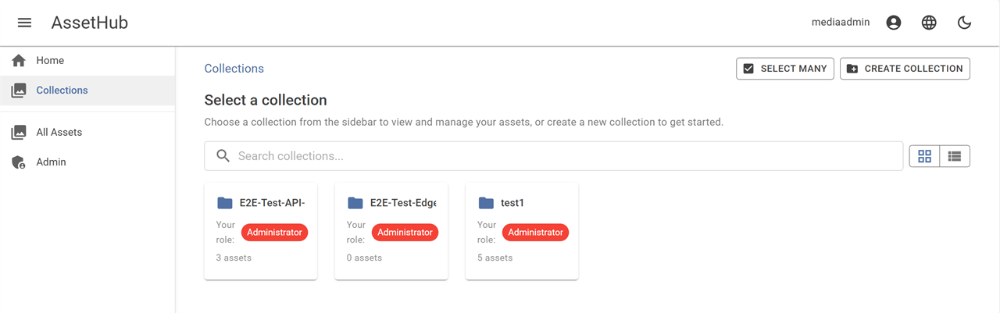

<div align="center">

# AssetHub

**Self-hosted digital asset management for a single team — legible enough to understand in an afternoon.**

Organise images, videos, and documents into collections. Control access with per-collection roles. Share via password-protected links. Get automatic thumbnails and previews — all on your own infrastructure, in one process.

[](#tech-stack)
[](LICENSE)
[](#quick-start)
[](#modular-components)


</div>

---

## Table of Contents

- [Quick Start](#quick-start)
- [Features](#features)
- [Screenshots](#screenshots)
- [Architecture](#architecture)
- [Modular Components](#modular-components)
- [Security](#security)
- [Deployment](#deployment)
- [Testing](#testing)
- [Tech Stack](#tech-stack)
- [Documentation](#documentation)
- [Contributing](#contributing)
- [License](#license)

---

## Quick Start

**Prerequisites:** [Docker](https://docs.docker.com/get-docker/) and [Docker Compose](https://docs.docker.com/compose/install/)

**1. Clone and start**

```bash
git clone <repository-url>
cd AssetHub
docker compose up --build
```

This starts the **three essential services** — the app, PostgreSQL, and MinIO
(file storage). That is everything you need to run and explore AssetHub.

To also run the optional extras — the ClamAV virus scanner, the Mailpit test
email server, and the Aspire telemetry dashboard — use the `full` profile, and
turn scanning on in the same command:

```bash
CLAMAV_ENABLED=true docker compose --profile full up --build
```

(Scanning stays off in the default stack because it has no scanner to talk to;
the `full` command brings the scanner up and enables scanning together.)

**2. Add the hostname**

The app issues host-scoped auth cookies bound to `assethub.local`, so browse to
that name rather than `localhost`. Add this line to your hosts file
(`C:\Windows\System32\drivers\etc\hosts` on Windows, `/etc/hosts` on Linux/Mac):

```
127.0.0.1 assethub.local
```

**3. Open and log in**

Navigate to **https://assethub.local:7252** and sign in. Sign-in is handled by
the app's own local accounts (ASP.NET Core Identity):

| User | Password | Role |
|------|----------|------|
| `admin` | set via `IDENTITY_ADMIN_PASSWORD` in your `.env` | Admin |
| `testuser` | set via `TEST_VIEWER_PASSWORD` in your `.env` (dev only) | Viewer |

The admin is seeded from `Identity:SeedAdmin` **only when the user store is
empty**. The `testuser` viewer is a dev-only convenience for the E2E gate — the
dev compose sets `Identity__SeedTestViewer=true`; production never does.

> All default passwords and connection strings are in [CREDENTIALS.md](CREDENTIALS.md).

---

## Features

AssetHub is deliberately scoped to five things and does them well: **assets**,
**collections**, **metadata & search**, **access control**, and **sharing**.

**Asset Management**
- Drag-and-drop upload with multi-collection organisation
- Auto-generated thumbnails, medium renditions, and video poster frames
  (ImageMagick + ffmpeg, running in-process)
- Faceted search — Postgres `tsvector` full-text over title, description and tags
  with live facet counts (asset type, collection, tags, status)
- Inline video playback and image/document preview
- Download originals, or download a whole collection or shared bundle as a ZIP archive

**Access Control & Sharing**
- Per-collection RBAC — Viewer, Contributor, Manager, Admin (system admins bypass
  all ACLs). Collections are flat — a user's role on a collection is the direct
  grant on it, nothing inherited
- Password-protected, time-limited share links with public (no-login) share pages
- Admin console with user management, share administration, a paginated audit log
  with filterable event types, and a Trash tab for restoring soft-deleted assets

**Lifecycle**
- Soft-delete with restore — deleted assets land in Trash with a configurable
  retention window (default 30 days), then a background service purges them
  permanently. An optimistic-undo snackbar in the asset grid and detail page makes
  single-click recovery the norm

**Security & Operations**
- Optional ClamAV malware scanning on every upload (content-type allowlist →
  magic-byte check → scan → size limits)
- Full audit trail for every action, with configurable per-event retention
- Container hardening with Docker secrets, network segmentation, and security headers
- Optional OpenTelemetry tracing/metrics/logs via the Aspire Dashboard

**Developer Experience**
- Clean Architecture with interface-driven services — swap any external component
- A deliberately tiny HTTP surface (`/api/v1/`) — 13 endpoints that deliver media
  bytes or report ZIP progress. Everything else the UI needs it calls in-process
- Single-instance, single-process: no message broker, no separate worker, no
  external cache to operate
- Localisation — Swedish and English, extensible via `.resx` files
- Accessibility — skip-to-content, ARIA labels, keyboard navigation, responsive viewports

---

## Screenshots

<details>
<summary><strong>Dashboard</strong></summary>
<br/>

<br/><br/>

<br/><br/>

</details>

<details>
<summary><strong>Collections</strong></summary>
<br/>

<br/><br/>

<br/><br/>

</details>

<details>
<summary><strong>Assets</strong></summary>
<br/>

<br/><br/>

<br/><br/>

</details>

<details>
<summary><strong>Sharing</strong></summary>
<br/>

<br/><br/>

<br/><br/>

</details>

<details>
<summary><strong>Administration</strong></summary>
<br/>

<br/><br/>

<br/><br/>

<br/><br/>

<br/><br/>

</details>

---

## Architecture

AssetHub follows **Clean Architecture** with strict dependency rules, and runs as
a **single process**. Every external service is abstracted behind an interface.

```
Domain  ←  Application  ←  Infrastructure  ←  Api
                ↑                              ↑
                Ui (Razor Class Library) ──────┘
```

| Project | Purpose |
|---------|---------|
| `AssetHub.Domain` | Entities, enums — zero dependencies |
| `AssetHub.Application` | Service interfaces, DTOs, constants, business rules, messages |
| `AssetHub.Infrastructure` | EF Core, MinIO, SMTP, ClamAV, local Identity implementations |
| `AssetHub.Api` | The single composition root — Blazor host, auth, DI wiring, in-process message handlers, background jobs, and the 13 media/ZIP endpoints |
| `AssetHub.Ui` | Blazor Server components and pages (Razor Class Library) |

Background work (media processing, ZIP building, retention sweeps) runs inside the
Api on an **in-process channel bus** (`System.Threading.Channels`). Durability
comes from a transactional **outbox** table plus a stuck-Processing reaper, not
from an external broker.

> Full architecture diagram, layer details, and resilience patterns in **[ARCHITECTURE.md](docs/architecture/ARCHITECTURE.md)**.

---

## Modular Components

Every external dependency can be swapped by implementing a clean interface:

| Component | Default | Interface | Swap with |
|-----------|---------|-----------|-----------|
| Storage | MinIO (S3 API) | `IMinIOAdapter` | AWS S3, Azure Blob, GCS |
| Database | PostgreSQL 16 | EF Core + Npgsql | SQL Server* |
| Email | SMTP (Mailpit in dev) | `IEmailService` | SendGrid, AWS SES |
| Malware Scan | ClamAV (clamd TCP) | `IMalwareScannerService` | Any scanner SDK |
| Tracing | Aspire Dashboard (OTLP) | OpenTelemetry | Jaeger, Datadog, Grafana |

<sub>*SQL Server requires migration rework for JSONB/pg_trgm features.</sub>

Messaging and caching are intentionally **not** in this table: the reshape removed
RabbitMQ/Wolverine (in-process `Channels` now) and Redis (in-memory `HybridCache`
now), so there is no external broker or cache to swap.

> Interface definitions and replacement guides in **[ARCHITECTURE.md](docs/architecture/ARCHITECTURE.md#modular-components)**.

---

## Security

| Category | Implementation |
|----------|---------------|
| **Authentication** | Local ASP.NET Core Identity — cookie sign-in via the app's own form. Host-scoped (`__Host-`) cookies, SameSite=Strict, HttpOnly |
| **Authorization** | Per-collection RBAC — Viewer, Contributor, Manager, Admin roles |
| **Rate Limiting** | Per-user, SignalR, anonymous shares, password brute-force protection |
| **Upload Security** | Content-type allowlist → magic byte check → optional ClamAV scan → size limits |
| **Data Protection** | Share tokens and passwords encrypted at rest via ASP.NET Data Protection. Password-reset links are single-use, expiring, and never logged |
| **Containers** | `cap_drop: ALL`, `no-new-privileges`, non-root users, read-only filesystems |
| **Secrets** | Docker secrets for all production credentials (file-based, not env vars) |
| **Network** | Isolated Docker networks for backend and observability services |
| **Headers** | HSTS, CSP, X-Frame-Options, referrer policy, permissions policy |
| **API surface** | Internal REST endpoints serving the Blazor UI's browser-side fetches (media, downloads). No public contract, no OpenAPI document, no SemVer promise — removed by the 2026-08 reshape |

> Full RBAC matrix and API security reference in **[SECURITY.md](docs/security/SECURITY.md)**.

---

## Deployment

The production stack runs via Docker Compose with hardened containers, resource
limits, and internal-only networking.

```bash
cp .env.template .env          # Configure secrets and domains
# Edit .env with your production values

docker compose -f docker/docker-compose.prod.yml up -d
```

> **[DEPLOYMENT.md](docs/operations/DEPLOYMENT.md)** — complete production deployment guide.

---

## Testing

| Layer | Framework | Scope |
|-------|-----------|-------|
| Unit + Integration | xUnit, Testcontainers, Moq | Repositories, endpoints, services, edge cases |
| Blazor Components | bUnit | Dialogs, grids, helpers |
| End-to-End | Playwright (TypeScript) | Auth, collections, assets, shares, admin, accessibility |

```bash
# .NET tests (unit + integration + bUnit)
dotnet test --configuration Release

# E2E tests (requires the stack running)
cd tests/E2E && npx playwright test
```

The E2E suite is **self-seeding** — its journeys create the collections and assets
they need, and both the admin and `testuser` viewer are seeded from an empty
database, so the gate runs from nothing with no hand-provisioned data.

---

## Tech Stack

| Layer | Technology |
|-------|------------|
| Backend | ASP.NET Core (.NET 10), C# 14 |
| UI | Blazor Server, MudBlazor 8 |
| Database | PostgreSQL 16, EF Core 10 (Npgsql) |
| Storage | MinIO (S3 API) |
| Messaging | In-process `System.Threading.Channels` + transactional outbox |
| Caching | `HybridCache`, in-memory only |
| Security | ClamAV (optional), ASP.NET Data Protection |
| Observability | OpenTelemetry, Aspire Dashboard (optional) |
| Containerisation | Docker Compose |

---

## Documentation

| Document | Contents |
|----------|----------|
| [ARCHITECTURE.md](docs/architecture/ARCHITECTURE.md) | System design, layer dependencies, modular interfaces, resilience patterns |
| [SECURITY.md](docs/security/SECURITY.md) | Auth, RBAC, rate limiting, upload security, container hardening, audit |
| [DEPLOYMENT.md](docs/operations/DEPLOYMENT.md) | Production setup, certificates, CI/CD, monitoring, backups, troubleshooting |
| [CREDENTIALS.md](CREDENTIALS.md) | Default passwords and connection strings |
| [CONTRIBUTING.md](CONTRIBUTING.md) | Development setup, code style, PR guidelines |

---

## Contributing

Contributions are welcome. See [CONTRIBUTING.md](CONTRIBUTING.md) for development
setup, code style, and PR guidelines.

---

## License

[Apache License 2.0](LICENSE)
