# AssetHub — Major Function Flowcharts

This document describes the major workflows in AssetHub using Mermaid flowcharts.

---

## Table of Contents

1. [Request Pipeline](#1-request-pipeline)
2. [Authentication & Authorization](#2-authentication--authorization)
3. [Asset Upload](#3-asset-upload)
4. [Asset Query & Retrieval](#4-asset-query--retrieval)
5. [Collection Management](#5-collection-management)
6. [Share & Public Access](#6-share--public-access)
7. [Background Job Processing](#7-background-job-processing)

---

## 1. Request Pipeline

How an incoming HTTP request flows through the ASP.NET Core middleware pipeline to reach an endpoint handler and produce a response.

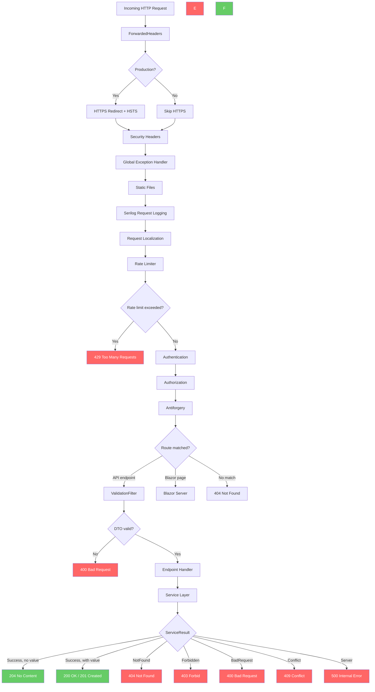

---

## 2. Authentication & Authorization

How the PolicyScheme routes between JWT and Cookie/OIDC, and how per-collection RBAC is enforced.

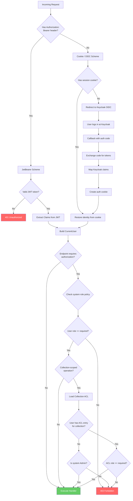

### Role Hierarchy

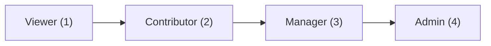

> Higher roles inherit all permissions of lower roles. System Admin bypasses all collection-level checks.

---

## 3. Asset Upload

The complete asset upload pipeline including validation, malware scanning, storage, and background processing.

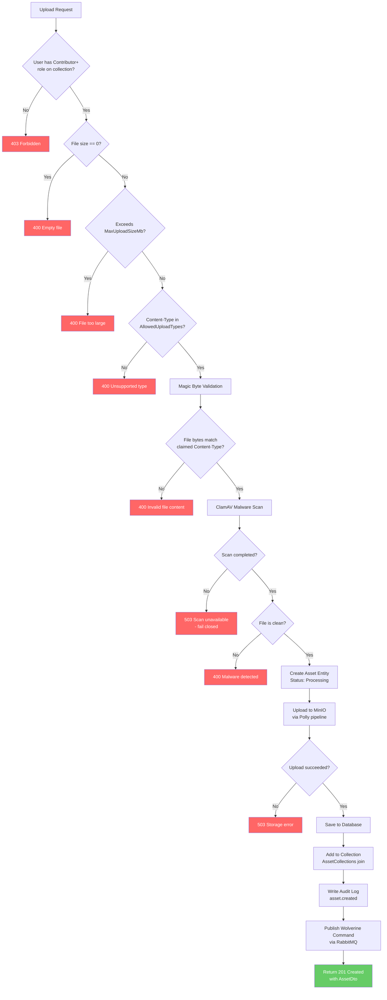

---

## 4. Asset Query & Retrieval

How assets are searched, filtered, and returned — with different paths for admins vs regular users.

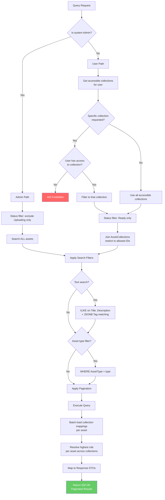

### Asset Download / Preview

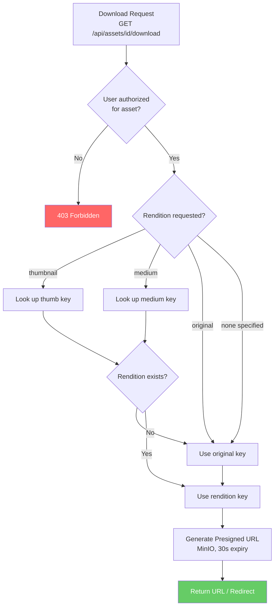

---

## 5. Collection Management

Creating, updating, deleting collections and managing per-collection access control lists.

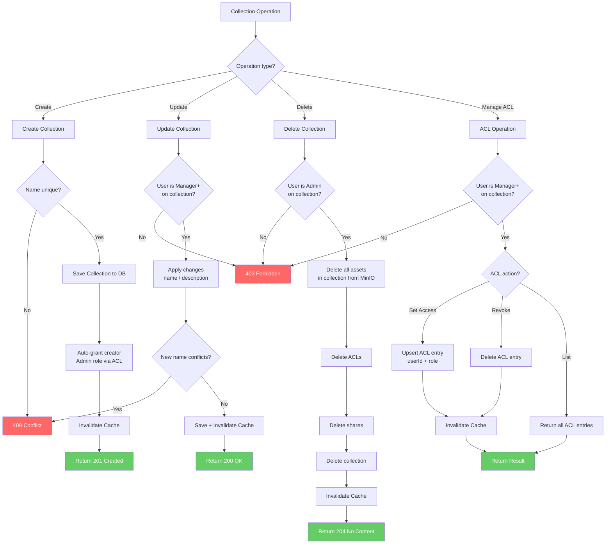

---

## 6. Share & Public Access

Creating share links with optional password protection, and validating share access tokens.

### Creating a Share

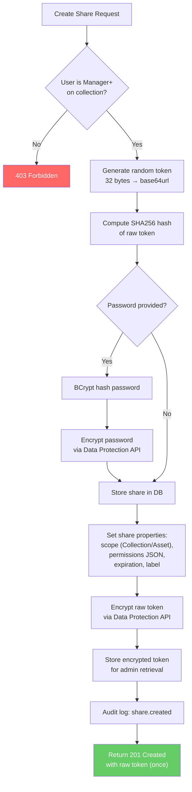

### Accessing a Share

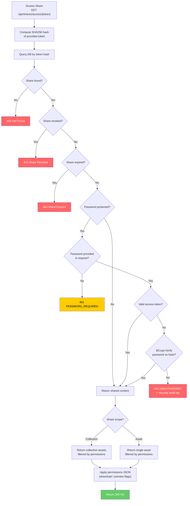

---

## 7. Background Job Processing

Media processing pipeline for uploaded assets, executed by the Wolverine Worker via RabbitMQ.

### Message Dispatch

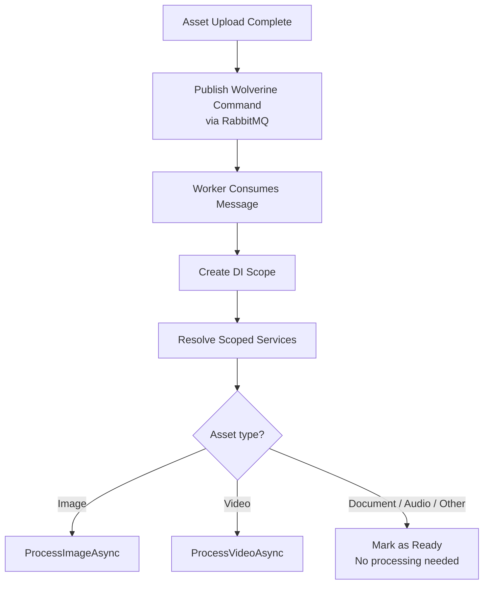

### Image Processing

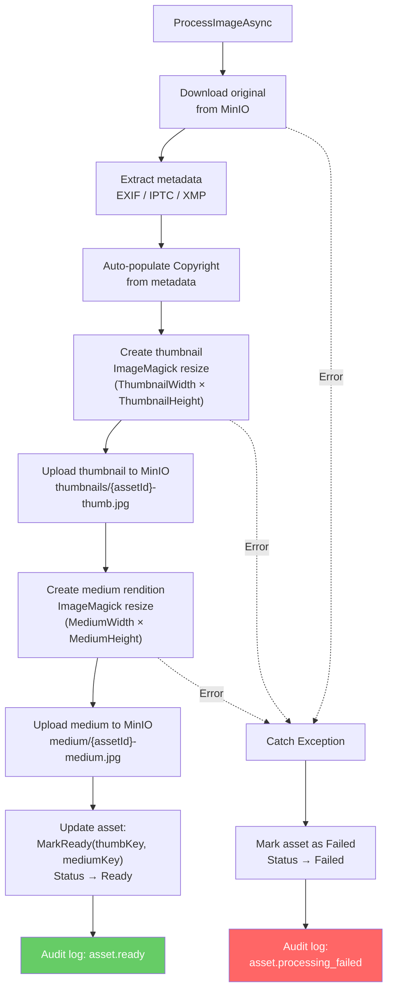

### Video Processing

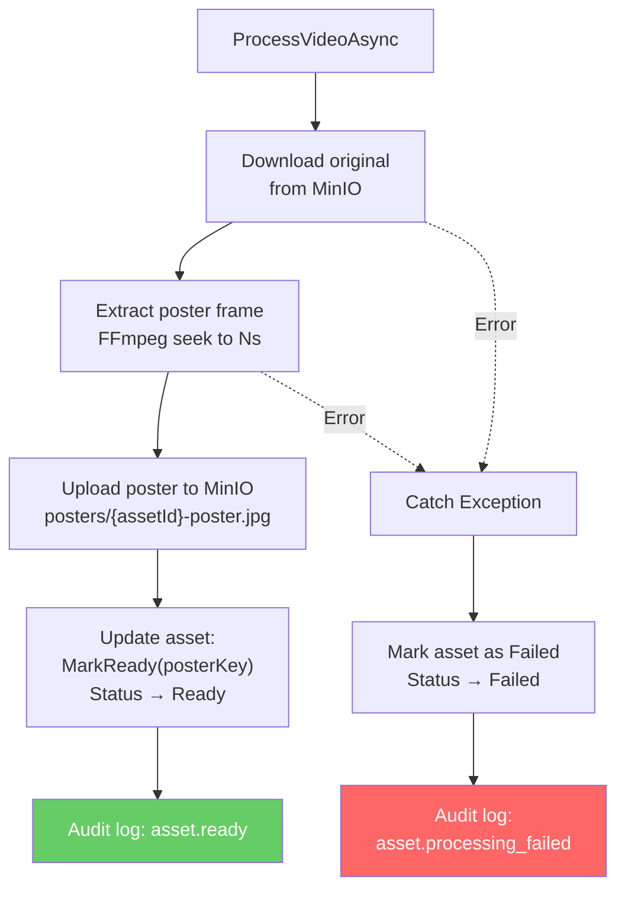

### Recurring Cleanup Jobs

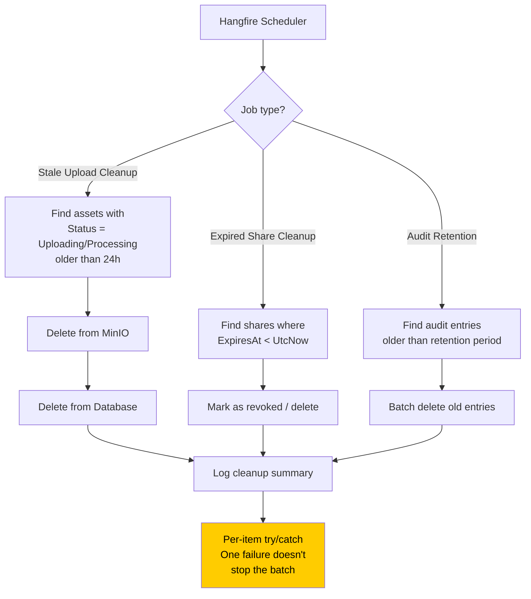

---

## Legend

| Symbol | Meaning |
|--------|---------|
| 🟢 Green nodes | Success / happy path endpoints |
| 🔴 Red nodes | Error / rejection responses |
| 🟡 Yellow nodes | Warning / requires attention |
| Solid arrows | Normal control flow |
| Dashed arrows | Error / exception flow |
